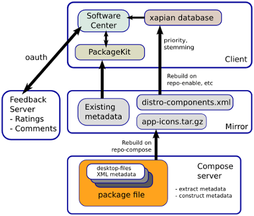

AppStream
=========

AppStream is a cross-distro effort for providing metadata for software in the (Linux) ecosystem. It provides a convenient way
to get information about not installed software, and is one of the building blocks for software centers.
It consists of specifications for things like upstream metainfo files, an unified software metadata pool for distributors,
screenshot services and various other useful bits needed to create user-friendly software-centers or other tools requiring
rich metadata for software and other content.

This repository contains:
 * the AppStream specification
 * the `appstreamcli` utility to access metadata, manipulate caches, show diagnostic information, etc. (see `man appstreamcli`)
 * a GLib/GObject based library for reading and writing AppStream metadata in XML and YAML, accessing the system data pool, and for various other useful methods.
 * a Qt5 based library for accessing AppStream.



## Useful Links
[AppStream Documentation](http://www.freedesktop.org/software/appstream/docs/) - The AppStream specification and help  
[Releases](http://www.freedesktop.org/software/appstream/releases/) - All releases of AppStream  
[AppStream on Freedesktop](http://www.freedesktop.org/wiki/Distributions/AppStream/) - The original Freedesktop.org page  

For help and development discussion, check out the [AppStream mailinglist](https://lists.freedesktop.org/mailman/listinfo/appstream).

If you are looking for a way to generate distribution AppStream metadata for a package repository,
you may want to take a look at [appstream-generator](https://github.com/ximion/appstream-generator).

## Developers
[](https://travis-ci.org/ximion/appstream)
[](https://hosted.weblate.org/engage/appstream/?utm_source=widget)

### Dependencies

#### Required
 * Meson (>= 0.42)
 * glib2 (>= 2.46)
 * GObject-Introspection
 * libxml2
 * libyaml

#### Optional
 * Vala Compiler (vapigen) (for Vala VAPI file)
 * [Snowball](http://snowballstem.org/download.html) (for stemming support)

#### Documentation / Specification
 * Publican

#### Qt (for libappstream-qt)
 * Qt5 Core

### Build instructions

To compile AppStream, make sure that you have all required libraries (development files!) installed.
Then continue (the build system will complain about missing dependencies).

Use Meson to configure AppStream and build it with ninja:
```bash
mkdir build
cd build
meson <flags> ..
ninja
ninja test
```
Possible AppStream-specific flags are:  
 -Dqt=true          -- Build the Qt interface library (default: false)  
 -Dvapi=true        -- Build Vala API to use the library with the Vala programming language (default: false)  
 -Ddocs=true        -- Build specification and other documentation, requires Publican (default: false)  
 -Dmaintainer=true  -- Enable strict compiler options - use this if you write a patch for AppStream (default: false)  
 -Dstemming=true    -- Enable support for stemming in fulltext searches (default: true)  
 -Dapt-support=true -- Enable integration with the APT package manager on Debian (default: false)

### Installation

To install the compiled binaries and required data, execute
`ninja install` with superuser permission.

## Translators
You can help translating AppStream via Weblate.
Check out the [AppStream Weblate Page](https://hosted.weblate.org/projects/appstream/translations/).
